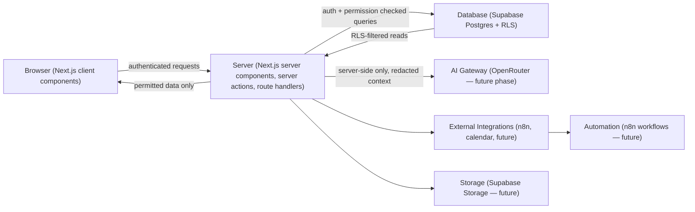
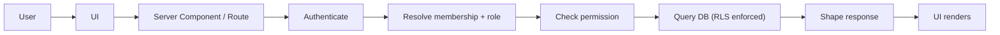

# Orex OS Architecture

## Architecture Goals

Secure multi-company isolation by default; server-enforced authorization backed by database-enforced authorization (defense in depth); traceability of every mutation; a modular system where new companies and future modules attach without rewriting the core; AI treated as a controlled, auditable actor rather than a privileged shortcut.

## Architecture Principles

1. The browser is never trusted for authorization decisions.
2. Every company-scoped table carries a company identifier and is protected by RLS.
3. Server actions/route handlers re-check authentication, membership, and permission on every request — session state is never assumed valid from a prior check.
4. Schema changes only happen through migrations.
5. AI never executes arbitrary queries; it calls allowlisted, permission-checked server functions.
6. Secrets live in a dedicated vault, never in ordinary tables, logs, or AI context.

## Current Architecture Summary

Per `docs/current-state-audit.md`: the repository is an unmodified Next.js 16 App Router + TypeScript + Tailwind v4 scaffold. No Supabase connection, no auth, no database, no server actions, no API routes, no components, and no data model exist yet. `lib/{auth,permissions,audit,database,validation,ai,integrations}` directories exist but are empty — they anticipate this target architecture's shared-library layout but contain no code. This document defines what Phase 001 (and later phases) will build into that empty structure.

## Target Architecture

Next.js App Router (server components by default, client components only where interactivity requires it) on top of Supabase Postgres, using Supabase Auth for identity and Supabase Row Level Security as the database-enforced authorization layer beneath server-side permission checks. Zod validates all input at every server boundary. OpenRouter (future phase) will be the sole AI provider gateway, called only from the server. Tailwind CSS plus a shared component library under `components/` implements the design system. n8n is available for external workflow automation where appropriate; PostHog is reserved for approved analytics only. No part of this stack replaces anything currently working — there is nothing working to replace yet.

## High-Level System Diagram



## Browser Responsibilities

Display permitted data; collect input; show action previews and AI recommendations; show audit history the current user is permitted to see; submit authenticated requests to the server. The browser never holds the Supabase service-role key, never calls OpenRouter directly, and never performs a privileged mutation itself — it only triggers server actions/routes that do.

## Server Responsibilities

Verify authentication on every request; resolve company membership and role; resolve granular permissions; validate input with Zod; execute the actual database mutation using the authenticated user's context (RLS still applies) or, only where genuinely required, a narrowly-scoped service-role operation that itself re-implements the same permission check in code; write an audit record for every meaningful mutation; return safe (non-leaking) error messages.

## Database Responsibilities

Enforce company-scoped access via RLS on every company-owned table; deny by default (no table is readable/writable without an explicit policy); keep audit records append-only where possible; use foreign keys and constraints to make the org/company/membership/role/permission graph structurally sound; timestamp and attribute every mutable row; support point-in-time recovery through Supabase's standard Postgres backups.

## AI Responsibilities

Not applicable in Phase 001 — no AI integration exists yet. Documented here for forward compatibility: future AI requests flow server-side only, through a redaction step that strips secrets/PII before context assembly, and any AI-initiated mutation goes through the same permission checks and audit logging as a human-initiated one, plus an explicit approval gate for risky actions (see `docs/ai/ai-action-policy.md`).

## Authentication Boundary

Supabase Auth issues a session (JWT + refresh token) to the browser via secure, httpOnly cookies through the Supabase SSR helper pattern. Next.js middleware refreshes/validates the session on every request. No route or server action trusts a client-supplied user id — the authenticated user is always resolved server-side from the verified session.

## Authorization Boundary

Sits immediately after authentication, on the server: given the verified user id, resolve `company_members` rows, resolve the role(s), resolve the permission set for the target company, and only then allow a handler to proceed. This check is duplicated (not replaced) by RLS at the database layer — a server bug that skips the check does not, by itself, allow cross-company data access, because RLS still filters the query.

## Company Isolation Boundary

Every operational table includes `company_id`. RLS policies restrict rows to companies the requesting user is an active member of (or, for the founder/group role, companies within the organisations they hold explicit group-level access to — never an unconditional `true` policy). A forged/tampered `company_id` in a request body cannot bypass this because the actual filter is the authenticated user's real membership rows, looked up server-side and enforced again by RLS — not the id the client sent.

## Data Access Flow

Browser request → server verifies session → server resolves membership/role/permission → server issues DB query as the authenticated user (RLS applies) → DB returns only rows the policies allow → server shapes/redacts response → browser renders.

## Read Request Flow



## Mutation Flow

```
User
→ UI
→ server action / route
→ authentication
→ company membership
→ permission
→ validation (Zod)
→ database (RLS enforced)
→ audit log
→ response
```

## AI Request Flow

Out of scope for Phase 001. Reserved for Phase 002+: Browser → server action → permission check (`ai.use`) → context assembly with redaction → OpenRouter → response → (if the AI proposes a mutation) structured action proposal → approval gate → allowlisted server function → audit log.

## AI Action Flow

Out of scope for Phase 001. Reserved: parse request → typed action proposal → schema validation → resolve target record → permission check → risk classification → approval if required → execute via allowlisted function → write mutation → write audit log → return result + audit reference.

## Audit Flow

Every server-side mutation handler calls a single shared audit helper (`lib/audit/`) after the mutation succeeds or fails, recording actor, company, resource, action, before/after state where appropriate, result status, and timestamp. No module writes its own ad hoc audit rows — see `.agents/skills/orex-audit-system/SKILL.md`.

## File Storage Architecture

Not implemented in Phase 001. Future: Supabase Storage, bucket-per-sensitivity-class, signed URLs, permission-checked access.

## Secrets Architecture

Not implemented in Phase 001 (no secrets vault feature is built). Principle carried forward from AGENTS.md: application secrets (Supabase keys, OpenRouter key) live only in server-side environment variables, never in the browser bundle, never in the database as plaintext, and a future client-secrets vault will be a dedicated, encrypted, access-audited feature — not an extension of ordinary tables.

## Integration Architecture

Not implemented in Phase 001. n8n and calendar integrations are future concerns; the module architecture below reserves an `integrations` shared library for them.

## Module Architecture

Recommended conceptual modules, most not yet created: companies (Phase 001), teams (Phase 001), knowledge (Phase 003, Company Brain), projects/delivery (Phase 004) are implemented; clients, calendar, finance, transactions, performance, daily-logs, risks, reviews, ai-agents, reports, secrets, advisor remain future, each requiring its own approved phase.

## Shared Libraries

`lib/auth` (session/user resolution), `lib/permissions` (role/permission resolution + server-side check helpers), `lib/audit` (audit-write helper), `lib/database` (Supabase server/browser clients), `lib/validation` (Zod schemas), `lib/ai` (future), `lib/integrations` (future). Phase 001 populates `auth`, `permissions`, `audit`, `database`, and `validation`; `ai` and `integrations` remain empty.

## Server and Client Component Rules

Default to server components. Use a client component only when the node needs interactivity (forms, the company switcher dropdown, live client-side state). Server actions handle all mutations; no direct browser-to-database calls for writes. Read-only browser Supabase client (anon key) may be used for realtime/interactive read cases in later phases, still subject to RLS.

## Error Handling

Server handlers catch and translate errors into safe, non-leaking messages before returning to the browser (no raw Postgres/Supabase error text, no stack traces). Internal error detail is still written to the audit/error log server-side for debugging.

## Loading States

Use Next.js `loading.tsx`/Suspense boundaries per route segment once real routes exist; Phase 001's minimal UI should still include a basic loading state for the company switcher and sign-in flow rather than a blank screen.

## Empty States

Every list/table view must define an explicit empty state (e.g., "no companies yet", "no invitations pending") rather than rendering nothing.

## Feature Flags

Not implemented in Phase 001. Reserved for future plugin architecture (AGENTS.md §17).

## Background Jobs

Not implemented in Phase 001. Future: Supabase scheduled functions or n8n for recurring AI agent runs, invitation-expiry sweeps, etc.

## Realtime Requirements

None for Phase 001.

## Logging

Server-side console/structured logging for operational debugging must never include secret values (API keys, tokens, passwords) or unredacted PII beyond what audit logging already stores appropriately.

## Monitoring

Not implemented in Phase 001. Deferred to a later operations phase.

## Backups

Relies on Supabase's managed Postgres backups once a project is provisioned. No custom backup tooling in Phase 001.

## Scalability

Not a Phase 001 concern at Orex Group's current scale; the schema (indexed `company_id`, `user_id` foreign keys) is designed not to require a rework as data grows.

## Deployment Considerations

Deployment target (Vercel vs other) is an open question (see `docs/current-state-audit.md` Unknowns) and does not block Phase 001, which can be developed and tested locally against a Supabase project.

## Architecture Risks

1. If Phase 001 ships server-side permission checks without matching RLS policies (or vice versa), the two layers can drift out of agreement — mitigated by pairing every new table's RLS design with its server-side check in the same implementation slice, and by the RLS test checklist in `.agents/skills/orex-rls-security/SKILL.md`.
2. Treating founder access as a bypass rather than explicit permissions would create a single high-value account with no enforced boundary — explicitly disallowed (see `docs/permissions.md`).

## Migration Concerns

All schema changes go through numbered Supabase migration files under `supabase/migrations/`, applied in order, never edited after being applied to a shared environment. Phase 001's migrations should be additive only (no destructive changes possible — the schema doesn't exist yet).

## Architecture Decisions Requiring ADRs

1. Whether Phase 001 provisions a live Supabase project now vs. staying migration-only until the founder connects one.
2. Session/middleware strategy specifics (Supabase SSR cookie helper version/pattern) once implementation starts.

## Phase 001 Architecture Boundary

Phase 001 establishes only the multi-company security foundation: Orex Group organisation, companies, user profiles, company memberships, roles, permissions, role-permissions, invitation-based registration, company switcher, founder group-access foundation, server-side permission helpers, company data isolation, RLS, and the audit log foundation — plus the minimal UI needed to exercise all of it. It does not implement OpenRouter, Company Brain, AI agents, or any operational module (projects, clients, finance, calendar, risk, performance, Builder Studio). No implementation begins from this document; it exists to be inspected and referenced when writing `prompts/001-foundation.md`, which itself requires separate founder approval before code is written.
