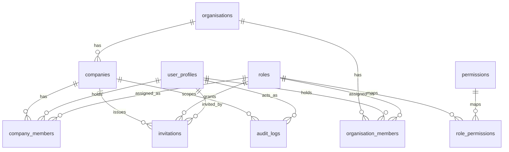

# Orex OS Data Model

Conceptual relational data model. No SQL, no migrations — this document informs `prompts/001-foundation.md`, which will list (but not create) proposed migrations.

## Foundation Entities

### organisations

- **Purpose**: the single top-level tenant — Orex Group. Exists mainly so the model doesn't hard-code "Orex Group" as a magic constant, and so a future second organisation (unlikely, but architecturally cheap to allow) doesn't require a schema change.
- **Scope**: group-scoped (root of the tree).
- **Important fields**: `id`, `name`, `slug`, `created_at`.
- **Ownership**: system/founder.
- **Relationships**: has many `companies`; has many `company_members` indirectly through companies; founder group-access grants reference this.
- **Sensitivity**: Internal.
- **Mutable**: rarely (name/slug only). Not append-only.
- **Soft delete**: not needed in Phase 001 (one row expected).
- **Audit**: any update audited.
- **Indexes**: unique on `slug`.
- **FK behavior**: n/a (root).
- **Deletion**: not supported in Phase 001 (no delete path).

### organisation_members

- **Purpose**: models group-level (organisation-wide) role assignments explicitly — most importantly the Founder CEO's group access — as real, auditable, revocable rows rather than a hardcoded bypass. A row here grants the assigned role's permissions across every company in the organisation, resolved through the same `role_permissions` catalog used by `company_members`.
- **Scope**: group-scoped (belongs to one `organisation`).
- **Important fields**: `id`, `organisation_id`, `user_id`, `role_id`, `status` (`active`/`removed`), `granted_by`, `granted_at`, `removed_at`, `removed_by`, `created_at`, `updated_at`.
- **Ownership**: founder-only, via `permissions.manage` (granting group-level access is itself a highly sensitive action).
- **Relationships**: belongs to `organisations`, belongs to `user_profiles`, belongs to `roles`.
- **Sensitivity**: Confidential (this table is the single highest-privilege grant in the system).
- **Mutable**: status/role changes only.
- **Soft delete**: yes — `status = 'removed'`, same pattern as `company_members`, so revoking founder-level access is instant and auditable without losing history.
- **Audit**: every grant, role change, and removal audited — this is the most security-sensitive audit trail in Phase 001.
- **Indexes**: `organisation_id`, `user_id`; unique partial index for one active row per (`organisation_id`, `user_id`).
- **FK behavior**: `organisation_id` restrict, `user_id` restrict, `role_id` restrict.
- **Deletion**: no hard delete in Phase 001; removal is a status change.

### companies

- **Purpose**: Orextic, Orex Studios, and future companies. The scoping anchor for almost all future operational data.
- **Scope**: belongs to one `organisation`.
- **Important fields**: `id`, `organisation_id`, `name`, `slug`, `accent_color_key` (design-system accent token, e.g. `orextic`/`orex-studios`), `status` (active/archived), `created_at`, `updated_at`.
- **Ownership**: founder/director-level, via `companies.manage`.
- **Relationships**: belongs to `organisations`; has many `company_members`; will have many future operational records (`projects`, `clients`, etc.) via `company_id`.
- **Sensitivity**: Internal.
- **Mutable**: yes (name, status, accent).
- **Soft delete**: yes — `status = 'archived'` rather than hard delete, since deleting a company would orphan or cascade-delete an unbounded amount of future operational data.
- **Audit**: create/update/archive all audited.
- **Indexes**: `organisation_id`; unique on (`organisation_id`, `slug`).
- **Unique constraints**: (`organisation_id`, `slug`).
- **FK behavior**: `organisation_id` → `organisations.id`, `on delete restrict`.
- **Deletion**: archive only, no hard delete in Phase 001.

### user_profiles

- **Purpose**: one profile per authenticated identity (1:1 with Supabase Auth user), holding non-auth profile data. Never duplicated per company — a person has exactly one identity across the whole group.
- **Scope**: group-scoped (not company-scoped).
- **Important fields**: `id` (= Supabase `auth.users.id`), `full_name`, `display_name`, `avatar_url`, `email` (denormalized copy for display/audit convenience, source of truth remains `auth.users`), `created_at`, `updated_at`.
- **Ownership**: the user themselves (self-updatable subset), founder/admin for role-relevant fields elsewhere (roles live on `company_members`, not here).
- **Relationships**: has many `company_members`; referenced by `audit_logs.actor_user_id`, `invitations.invited_by`/`accepted_by`.
- **Sensitivity**: Internal (email is Internal, not Secret).
- **Mutable**: yes.
- **Soft delete**: not in Phase 001 (account deactivation is handled via membership removal, not profile deletion).
- **Audit**: profile changes audited.
- **Indexes**: none beyond PK (email lookups go through Supabase Auth, not this table).
- **FK behavior**: `id` → `auth.users.id`, `on delete cascade` (Supabase-managed).
- **Deletion**: cascades only if the underlying auth user is deleted (an explicit, rare admin action, not a normal app path in Phase 001).

### company_members

- **Purpose**: the membership edge — which user belongs to which company, with which role, and whether that membership is currently active. This is the row RLS policies join against for company isolation.
- **Scope**: company-scoped (references one company; belongs conceptually to that company's boundary).
- **Important fields**: `id`, `company_id`, `user_id`, `role_id`, `status` (`active`/`removed`), `invited_by`, `joined_at`, `removed_at`, `removed_by`, `created_at`, `updated_at`.
- **Ownership**: founder/director via `team.invite`/`team.remove`/`team.update`.
- **Relationships**: belongs to `companies`, belongs to `user_profiles`, belongs to `roles`.
- **Sensitivity**: Internal.
- **Mutable**: yes (status, role_id).
- **Soft delete**: yes — `status = 'removed'` (with `removed_at`/`removed_by`) rather than hard delete, so removal history and past audit records remain coherent (a removed member's historical audit rows still resolve to a real actor).
- **Audit**: every status/role change audited (this is one of the highest-value audit trails in the whole system).
- **Indexes**: `company_id`, `user_id`; composite (`company_id`, `user_id`).
- **Unique constraints**: one active membership per (`company_id`, `user_id`) — enforced as a partial unique index on active rows, since a user could theoretically be re-invited after removal.
- **FK behavior**: `company_id` → `companies.id` restrict; `user_id` → `user_profiles.id` restrict; `role_id` → `roles.id` restrict.
- **Deletion**: no hard delete in Phase 001; removal is a status change.

### roles

- **Purpose**: named role definitions (Founder, Director, Manager, Finance, Project Manager, Creative Lead, Member, Contractor, Viewer) that map to a set of permissions via `role_permissions`.
- **Scope**: group-scoped (roles are defined once, usable across all companies) — not duplicated per company. A company does not get its own copy of "Manager"; the same role row is referenced by memberships in any company.
- **Important fields**: `id`, `key` (stable machine name, e.g. `founder`, `director`, `contractor`), `label`, `description`, `is_system` (true for the seeded default roles — protects them from accidental deletion), `created_at`.
- **Ownership**: founder via `permissions.manage`.
- **Relationships**: has many `role_permissions`; referenced by `company_members.role_id`.
- **Sensitivity**: Internal.
- **Mutable**: label/description mutable; `key` immutable after creation.
- **Soft delete**: system roles cannot be deleted in Phase 001; custom roles are out of scope for Phase 001 (only the seeded default set exists).
- **Audit**: role definition changes audited.
- **Indexes**: unique on `key`.
- **FK behavior**: n/a (referenced, not referencing).
- **Deletion**: not supported for `is_system = true` rows in Phase 001.

### permissions

- **Purpose**: the atomic, granular permission catalog (e.g., `companies.read`, `finance.approve`, `ai.use`) referenced by AGENTS.md §9 and `docs/permissions.md`.
- **Scope**: group-scoped (global catalog).
- **Important fields**: `id`, `key` (e.g. `finance.read`), `label`, `category` (e.g. `companies`, `finance`, `ai`), `created_at`.
- **Ownership**: founder-managed, effectively static/seeded in Phase 001.
- **Relationships**: has many `role_permissions`.
- **Sensitivity**: Internal.
- **Mutable**: rarely (label/category only).
- **Soft delete**: not needed.
- **Audit**: catalog changes audited (rare).
- **Indexes**: unique on `key`.
- **FK behavior**: n/a.
- **Deletion**: not supported in Phase 001.

### role_permissions

- **Purpose**: the join table mapping roles to permissions — the actual permission matrix in data form.
- **Scope**: group-scoped.
- **Important fields**: `role_id`, `permission_id`, `created_at`.
- **Ownership**: founder via `permissions.manage`.
- **Relationships**: belongs to `roles`, belongs to `permissions`.
- **Sensitivity**: Internal.
- **Mutable**: rows added/removed to change a role's permission set.
- **Soft delete**: not needed — a row's presence/absence is the state.
- **Audit**: every add/remove audited (this is a role-escalation-sensitive table).
- **Indexes**: composite PK (`role_id`, `permission_id`).
- **FK behavior**: both FKs `on delete cascade` (if a role or permission is ever deleted, its mappings go with it — though deletion isn't supported in Phase 001 anyway).
- **Deletion**: rows deleted directly when unassigning a permission from a role.

### invitations

- **Purpose**: invitation-based registration — the only way a new user gains a company membership (no open self-signup).
- **Scope**: company-scoped (each invitation targets one company + one role).
- **Important fields**: `id`, `company_id`, `role_id`, `email`, `token_hash` (never store the raw token), `invited_by`, `status` (`pending`/`accepted`/`revoked`/`expired`), `expires_at`, `accepted_by`, `accepted_at`, `created_at`.
- **Ownership**: founder/director via `team.invite`.
- **Relationships**: belongs to `companies`, belongs to `roles`, references `user_profiles` for `invited_by`/`accepted_by`.
- **Sensitivity**: Confidential (email + token hash).
- **Mutable**: status transitions only.
- **Soft delete**: not needed — status covers lifecycle; expired/revoked rows are kept for audit history, not deleted.
- **Audit**: create, accept, revoke, expire all audited.
- **Indexes**: `company_id`; unique on `token_hash`; index on `email` + `status` for lookup.
- **FK behavior**: `company_id` restrict, `role_id` restrict.
- **Deletion**: never hard-deleted in Phase 001 (audit value).

### audit_logs

- **Purpose**: the append-only record of every meaningful mutation across the system, satisfying AGENTS.md §11.
- **Scope**: company-scoped where the action is company-scoped; nullable `company_id` for group-level actions (e.g., organisation-level changes).
- **Important fields**: `id`, `actor_user_id`, `actor_type` (`human`/`ai_agent`/`system`/`automation`), `organisation_id`, `company_id` (nullable), `resource_type`, `resource_id`, `action`, `before_state` (jsonb, nullable), `after_state` (jsonb, nullable), `reason` (nullable), `approval_status` (nullable), `approval_user_id` (nullable), `ai_session_id` (nullable), `ai_agent_id` (nullable), `request_metadata` (jsonb), `result_status` (`success`/`failure`), `error_details` (nullable, secret-redacted), `created_at`.
- **Ownership**: system-written only; no user-facing edit path.
- **Relationships**: references `user_profiles` (actor, approver), `companies`, `organisations`.
- **Sensitivity**: Confidential (may reference other confidential data via before/after state — must never contain secret values).
- **Mutable**: no — append-only. No update/delete path in application code.
- **Soft delete**: n/a (never deleted).
- **Audit**: audit logs are not audited recursively; they are the audit trail.
- **Indexes**: `company_id`, `actor_user_id`, `created_at`, `resource_type` + `resource_id`.
- **FK behavior**: actor/company FKs `on delete restrict` conceptually, though in practice these should rarely if ever be deleted; Supabase auth-user cascade is the one exception already covered by `user_profiles`.
- **Deletion**: append-only; ordinary users (including Directors) cannot edit or delete rows — enforced by RLS (no UPDATE/DELETE policy) and by application code never exposing such a path.

## Relationships (summary)

## Phase 003 Tables (implemented, CLOSED — see `prompts/003-company-brain.md`)

- **knowledge_sources** — provenance for every knowledge item (`manual_entry`, `pasted_text`, and reserved-for-future `project`/`client`/`meeting`/`daily_log`/`system_event`/`report`/`external_integration` types). Group-scoped when `company_id` is null.
- **knowledge_items** — the knowledge unit (fact/document/vision/mission/goal/service/strategy/rule/policy/process/sop/lesson/win/failure/research). Verified facts are structurally separated from AI-generated inference via three independent columns rather than the single `knowledge_facts.is_verified` flag originally anticipated here: `origin_type` (human/ai_extracted/system), `verification_status` (candidate/verified/rejected), plus `lifecycle_status` (current/stale/superseded/archived) for freshness. `company_id` nullable for Orex Group-level knowledge.
- **knowledge_chunks** — retrieval unit (1..N per `knowledge_items` row), carries the `pgvector` embedding (`vector(1536)`), embedding model/dimension/timestamp metadata.
- **decisions / decision_reviews** — implemented as originally anticipated below, company or group-scoped; `decision_reviews` is append-only so a decision's review history accumulates rather than being overwritten. `decisions.project_id` (nullable FK to `projects.id`, added in Phase 004) links a decision to the project it relates to; a database trigger (`enforce_decision_project_scope`, migration `0022`) rejects any attempt to set it to a project outside the decision's own organisation/company, independent of the equivalent application-level check.

## Phase 004 Tables (implemented, CLOSED — see `prompts/004-projects-delivery.md`)

- **projects** — the operational source of truth: identity, lifecycle `status` (draft/planned/active/on_hold/review/delivery_ready/delivered/completed/cancelled/archived — `at_risk` is a `health_state` value only, never a lifecycle status), `health_state` (healthy/attention/at_risk/blocked) kept fully independent of `status`, `client_display_name` (no `client_id` column — deferred to Phase 005's real Clients model, deliberately with no reserved/unconstrained UUID column to migrate away from).
- **project_members** — the resource-scoping mechanism anticipated in the "Future Entities" note above and `docs/permissions.md`'s former "Resource Scope" placeholder: an additional restriction on top of (never a replacement for) company-level authorization, gated by the new `roles.is_resource_scoped` column (`true` only for Contractor).
- **project_milestones**, **project_tasks** — reusable, company-agnostic records; no per-company-type schema values or template tables. `project_milestones.parent_milestone_id` (nullable self-FK, added in the "Projects Database" pass) supports arbitrarily nested milestone trees; a trigger (`enforce_milestone_parent_integrity`, migration `0027`) rejects same-milestone self-parenting, a parent from a different project, a cycle, or a chain deeper than 10 levels — independent of any client-side tree validation.
- **project_deliverables / project_deliveries** — same append-only-history split as `decisions`/`decision_reviews`: a deliverable can be delivered more than once, so `project_deliveries` is a separate, insert-only table (no UPDATE/DELETE policy at all — verified live that even a founder-level client role cannot alter a written delivery record).
- **project_scope_changes** — scope-change log with an approval gate; never touches finance/pricing.
- **project_readiness_checks** — relational (not `jsonb`) per-project delivery-readiness checklist; checks are created ad hoc per project, never a schema-level template.
- **project_activity** — operational timeline, explicitly distinct from `audit_logs` (which remains security/compliance history); written alongside, never instead of, the audit log for the same mutation.

## Project Folders (implemented, see `prompts/008-project-folders-and-hero.md`)

- **project_folders** — organisational grouping only, never an authorization boundary: `projects.folder_id` (nullable) is not consulted by any RLS policy on `projects` itself. Self-referencing `parent_folder_id` guarded the same way as `project_milestones` (same-company parent, no self-parent, no cycle, max depth 10, `enforce_folder_parent_integrity` trigger). `enforce_project_folder_scope` (on `projects`) rejects a `folder_id` from a different company than the project.

## Projects Database Tables (implemented, see `prompts/007-projects-database.md`)

- **project_property_definitions** — user-created ("custom") project metadata only; SYSTEM properties (Status, Priority, Deadline, Client, ...) are the real `projects` columns above and are never rows here. `company_id` nullable for a future org-wide definition (not exposed in the UI yet). `configuration` (jsonb) holds the type-specific shape (e.g. `select`'s option list) and is Zod-validated server-side per `property_type`, never trusted as opaque JSON.
- **project_property_values** — one row per (project, property_definition), `value` (jsonb) Zod-validated against the definition's `property_type` (a `person` value must resolve to a real, currently active company member). A trigger (`enforce_property_value_scope`, migration `0027`) rejects a value whose project belongs to a different company/organisation than its property definition.
- **project_views** — one row per (company, user) in this pass — a per-viewer column visibility/order preference, not a multi-view picker yet. Never duplicates project rows; purely a rendering preference over the same underlying data.

## Future Entities (conceptual only, still not built)

- **clients / client_contacts** — company-scoped; secrets (if any) live in a future dedicated vault, never on these tables.
- **meetings** — company-scoped, references projects/clients.
- **accounts / transactions / recurring_transactions** — company-scoped, Restricted sensitivity, gated by `finance.*` permissions.
- **daily_logs** — company-scoped, personal-reflection fields separated from evidence-based fields per AGENTS.md.
- **risks / opportunities** — company-scoped, evidence-required fields (per AGENTS.md's ban on unsupported inference).
- **ai_agents / ai_runs / ai_action_requests / ai_action_results** — the future AI Agents module; `ai_action_requests`/`results` mirror the audit shape closely by design.

## Important Rules Applied

- Every future company-owned operational record includes `company_id` with an RLS policy — no exceptions.
- User identity is never duplicated per company; `company_members` is the only per-company row for a person.
- No passwords or API secrets appear in any table above; a future dedicated secrets vault is the only place they may live.
- `knowledge_items` (Phase 003, implemented) structurally separates verified facts from AI inference via `origin_type`/`verification_status` columns rather than relying on a convention within one field — see "Phase 003 Tables" above.

## Phase 001 Tables

Implemented (Phase 001 scope): `organisations`, `organisation_members`, `companies`, `user_profiles`, `company_members`, `roles`, `permissions`, `role_permissions`, `invitations`, `audit_logs`.

## Phase 002 Tables

Implemented: `ai_usage_events` (see `prompts/002-openrouter-gateway.md`).

## Phase 003 Tables

Implemented: `knowledge_sources`, `knowledge_items`, `knowledge_chunks`, `decisions`, `decision_reviews` — see "Phase 003 Tables" above.

## Phase 004 Tables

Implemented: `projects`, `project_members`, `project_milestones`, `project_tasks`, `project_deliverables`, `project_deliveries`, `project_scope_changes`, `project_readiness_checks`, `project_activity` — see "Phase 004 Tables" above. Also modified: `roles` (+`is_resource_scoped`), `decisions` (+`project_id`).

## Projects Database Pass (2026-09-05)

Implemented: `project_property_definitions`, `project_property_values`, `project_views` — see "Projects Database Tables" above. Also modified: `project_milestones` (+`parent_milestone_id`). Not part of this pass (flagged, not silently dropped): `projects.value_amount`/`currency_code` and `projects.last_reviewed_at`/`last_reviewed_by` — see `prompts/007-projects-database.md` "Remaining Gaps".

## Future Tables

Everything listed under "Future Entities" above — not yet created.

## Open Data Model Questions

1. Should `company_members` support multiple simultaneous roles per (company, user), or exactly one role per membership (simpler, matches AGENTS.md's examples of "the founder can be Founder CEO in Orex Group, Director in Orextic, and Director in Orex Studios" — one role per company scope)? This document assumes one role per membership; a resource-scoped exception (project-only contractor access) is deferred to the future `project_members` table, not modeled as multiple roles here.
2. Should `roles` support custom, non-system roles in Phase 001, or only the nine seeded defaults? This document assumes only seeded defaults for Phase 001, with `is_system` reserving room for custom roles later.
3. Resolved: founder/group-level access is modeled as an explicit `organisation_members` table (see above) rather than an implicit rule or bypass — see `docs/permissions.md` "Founder Access".
