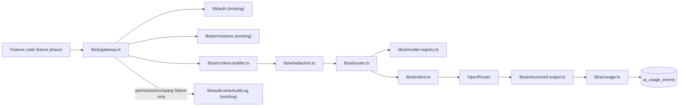

# Phase 002: OpenRouter AI Gateway

## Status

IMPLEMENTED (2026-09-05) — approved by the founder with the decisions recorded below, then built and verified (unit tests, live OpenRouter integration test, Phase 001 regression, browser-bundle secret scan).

### Founder decisions (override the Open Questions below)

1. OpenRouter client: `@openrouter/sdk`, isolated entirely behind `lib/ai/client.ts` — no other module imports it.
2. Initial model routing (PROPOSED configuration, not permanent): `ops.fast`/`knowledge.extract`/`finance.structured` → primary `openai/gpt-5.4-mini`; `advisor.deep`/`risk.deep`/`builder.long` → primary `anthropic/claude-sonnet-4.6`; `meeting.research`/`agent.tools` defined but not wired to any real feature.
3. Provider privacy routing: Public/Internal unconstrained; Confidential → `dataCollection: "deny"`; Restricted → `dataCollection: "deny"` + `zdr: true` + `requireParameters: true`; Secret never reaches OpenRouter (hard-fails at context construction if ever attempted).
4. No diagnostic UI page — verification is unit tests + a live-network integration test (`npm run test:integration`), not a founder-facing page.
5. `OPENROUTER_API_KEY` treated as opaque; never printed/logged/documented.
6. Usage/cost accounting sourced from OpenRouter's own response `usage` metadata (tokens, cost) — no static price table maintained.
7. Database: only `ai_usage_events` created, exactly as proposed.
8. Tool-call parsing types only — no tools registered, no mutation capability.
9. Shared secret-redaction extraction proceeded, verified behavior-identical via a new test (`lib/audit/redaction.test.ts`) plus the full existing Phase 001 suite passing unmodified.

**Implementation-time finding, not an architecture change:** the router's error classifier initially had no explicit case for OpenRouter's `400 BadRequestResponseError` (only `404`), so a misconfigured/invalid model id was falling into the generic `INVALID_PROVIDER_RESPONSE` bucket instead of `MODEL_UNAVAILABLE`. Found via the live integration test, fixed in `lib/ai/errors.ts` (`docs/ai/openrouter-architecture.md`'s Error Handling section already anticipated this category; the fix just corrects which HTTP statuses map to it).

## Objective

Build one secure, server-only AI infrastructure layer — the Orex AI Gateway — that every future Orex OS intelligence feature calls through, instead of talking to OpenRouter directly. The gateway inherits Phase 001's authentication, permission, and company-isolation guarantees as a hard dependency (not a reimplementation), adds AI-specific context redaction, task-alias-based model routing with fallback, structured-output validation, and usage/cost tracking. Phase 002 is infrastructure only: no Company Brain, no autonomous agents, no specific product AI feature, and no real mutation capability.

## Phase 001 Foundation Available

Verified by inspecting the actual Phase 001 code (not just its planning docs):

- **Authentication**: `lib/auth/session.ts` — `getCurrentUser()`/`requireCurrentUser()`, backed by Supabase Auth via `lib/database/server.ts`'s cookie-bound server client. Reused as-is; Phase 002 adds no new session mechanism.
- **Permissions**: `lib/permissions/index.ts` — `hasPermission(companyId, key)`, `hasOrgPermission(organisationId, key)`, `requirePermission(companyId, key)`, all backed by the `has_company_permission`/`has_org_permission` SQL functions (`supabase/migrations/0006_company_members_and_rls_helpers.sql`). The `ai.use`, `ai.approve`, `ai.manage` permission keys are already seeded in the catalog and mapped in the Phase 001 role matrix (`supabase/migrations/0002_roles_permissions.sql`) — Phase 002 can use `ai.use` immediately with zero new migrations for the permission layer itself.
- **Company resolution**: every Phase 001 server action re-derives company access from the caller's real `company_members`/`organisation_members` rows — never from a client-supplied id. Phase 002's gateway entrypoint must follow the identical pattern.
- **RLS helpers**: `has_company_permission`, `has_org_permission`, `my_effective_permissions` (SQL, `SECURITY DEFINER`) — available to call via `.rpc()` from any server code, including the gateway.
- **Audit system**: `lib/audit/index.ts` — `writeAuditLog()`, service-role client, key-pattern secret redaction already implemented (`SECRET_KEY_PATTERN` regex). Phase 002's context redaction reuses/extends this exact pattern rather than reimplementing it.
- **Server actions pattern**: `app/actions/*.ts` — `"use server"` files, Zod-parse input first, permission check second, mutation/query third, audit last. Phase 002's gateway functions follow the same shape (parse → auth → permission → work → track).
- **Environment handling**: `.env.example` already reserves `OPENROUTER_API_KEY` and `OPENROUTER_DEFAULT_MODEL` (unused by any code today — confirmed via `grep -rhoE "process\.env\.[A-Z_]+"` across `app/` and `lib/`, which returns only Supabase/Resend/APP_URL references). `SUPABASE_SERVICE_ROLE_KEY` is never imported outside `lib/database/server.ts`'s `createServiceRoleClient()`, confirmed absent from the built browser bundle — the exact pattern Phase 002 must replicate for `OPENROUTER_API_KEY`.
- **Validation architecture**: `lib/validation/*.ts` — Zod schemas, parsed with `.parse()` (throws on invalid input) at the top of every action. Phase 002's structured-output validation is the same library, applied to model responses instead of form input.
- **No API routes exist**: everything is Server Actions; there is no `app/api/` directory. Phase 002 should default to the same pattern (a server action / internal function, not a new API route) unless a concrete reason requires an HTTP endpoint (e.g., a future webhook).
- **Error handling pattern**: `throw new Error(message)` in server actions, caught client-side, generic user-facing messages, no raw provider/database error text surfaced. Phase 002 introduces a typed error taxonomy (see Error Handling) layered on top of this same throw/catch shape.
- **TypeScript patterns**: strict mode, `@/*` path alias, `"server-only"` import at the top of server-exclusive modules (`lib/auth/session.ts`, `lib/permissions/index.ts`, `lib/audit/index.ts`, `lib/integrations/email.ts` all do this already).
- **Test setup**: Vitest 3, `vitest.config.ts` with `vite-tsconfig-paths`, `environment: "node"`, colocated `*.test.ts` files (`lib/permissions/role-cap.test.ts`, `lib/auth/invitation-token.test.ts`, `lib/validation/invitations.test.ts` — 15 tests total, all passing). Phase 002's new logic (redaction, routing, fallback, structured-output validation) is unit-testable the same way, without a live OpenRouter connection, using dependency injection / mockable client boundaries.
- **No existing AI code**: `lib/ai/` does not exist as a directory at all (confirmed — no `find lib -type f` result under `lib/ai`). Phase 002 creates it from nothing.
- **Data model**: `docs/data-model.md` already documents `ai_agents`, `ai_runs`, `ai_action_requests`, `ai_action_results` as *future* entities, explicitly not built in Phase 001. `audit_logs` already has `ai_session_id`/`ai_agent_id`/`approval_status`/`approval_user_id` columns reserved and unused — available for a later phase's AI-action audit rows, not needed by Phase 002's read-only scope.

## Scope

- Server-only OpenRouter client (`lib/ai/client.ts`) — the only code in the repository allowed to hold/use `OPENROUTER_API_KEY`.
- Internal Orex AI gateway entrypoint (`lib/ai/gateway.ts`) — the only sanctioned way any feature calls AI.
- Model registry + task/model aliases (`lib/ai/model-registry.ts`) per `docs/ai/model-routing.md`.
- Model router with primary + bounded fallback (`lib/ai/router.ts`).
- Provider controls (timeout, bounded retry) — implemented inside the router/client, not a separate module.
- Structured-output helper + Zod validation (`lib/ai/structured-output.ts`, `lib/ai/schemas/`).
- Tool-call *parsing* foundation only (`lib/ai/tools/types.ts`) — recognizing a tool-call-shaped response; no tools registered, no execution.
- Context builder foundation (`lib/ai/context-builder.ts`) — a minimal, generic shape; no real business-data queries (no operational modules exist yet to query).
- Context redaction (`lib/ai/redaction.ts`), shared/extended from `lib/audit`'s existing secret-key-pattern logic.
- Company-scope enforcement and user-permission enforcement — reused directly from `lib/permissions`, not reimplemented.
- Data-sensitivity enforcement per the five-level classification (`lib/ai/redaction.ts`'s classification pass).
- AI usage tracking: token usage, cost, latency, model, provider, prompt-version metadata — written to a new `ai_usage_events` table (see Database Changes).
- Error normalization (`lib/ai/errors.ts`) covering every failure mode listed in Error Handling below.
- Timeout handling, bounded retry policy, safe fallback behavior — inside `lib/ai/router.ts`/`lib/ai/client.ts`.
- Rate-limit *response handling* from OpenRouter (treated as a transient, retryable/fallback-triggering error) — not Orex OS's own inbound rate limiting (explicitly out of scope, carried-over Phase 001 risk).
- Audit metadata integration: a security-relevant AI event (permission denied, company-resolution failure) writes a normal `audit_logs` row via the existing `writeAuditLog()` helper; routine successful calls do not (see Audit Integration).
- A minimal, founder-gated, non-production-only diagnostic page to manually exercise the gateway with a test alias (see UI Scope) — justified because no real feature exists yet to exercise it through, and Testing item requirements below need a way to manually verify the live OpenRouter integration once a real key is configured.

## Out of Scope

Company Brain, embeddings/knowledge retrieval, autonomous agents, Founder Advisor product UI, Finance Agent, Risk Agent, Meeting Research Agent, Builder Studio, automatic database mutations, autonomous external communication, arbitrary SQL, agent scheduling, long-term memory, any real task alias wired to a real feature (aliases exist in the registry as configuration/test fixtures, not live product surfaces), Orex OS's own inbound rate limiting, an admin UI for live-editing the model registry or prompts.

## Architecture



Reuses Phase 001's `lib/database/server.ts` for both the RLS-scoped server client (permission checks, `ai_usage_events` reads a user is allowed to see) and the service-role client (writing `ai_usage_events`, same pattern as `lib/audit`).

## Request Lifecycle

```
Feature code
→ lib/ai/gateway.ts: requestAI(taskAlias, companyId, input)
→ requireCurrentUser() [lib/auth]
→ requirePermission(companyId, "ai.use") [lib/permissions] (+ task-specific permission if the caller declares one)
→ resolve company scope server-side (re-derive from real membership; ignore any client claim beyond the id used to look up membership)
→ buildContext(taskAlias, companyId, userId, input) [lib/ai/context-builder.ts]
→ redact(context) [lib/ai/redaction.ts] — unconditional secret strip, then classification-based strip
→ resolveModel(taskAlias) [lib/ai/router.ts] → { primary, fallbacks }
→ callWithFallback(client, models, prompt, timeout, retry) [lib/ai/router.ts + client.ts]
→ validateStructuredOutput(response, taskAlias's schema) [lib/ai/structured-output.ts]
→ recordUsage({...}) [lib/ai/usage.ts] (success or failure, always)
→ return typed AIResult<T> | throw typed AIGatewayError
```

A permission or company-resolution failure short-circuits before any context is built or any OpenRouter call is made, and writes an `audit_logs` row (see Audit Integration) in addition to an `ai_usage_events` row.

## Model Routing

Implements `docs/ai/model-routing.md` directly. Aliases (`advisor.deep`, `ops.fast`, `finance.structured`, `risk.deep`, `meeting.research`, `builder.long`, `knowledge.extract`, `agent.tools`) live in `lib/ai/model-registry.ts` as a typed, static config object — not a database table (see Database Changes for reasoning). Each alias entry: `primaryModel`, `fallbackModels: string[]`, `latencyClass`, `costClass`, `requiresStructuredOutput`, `requiresTools`, `contextSizeClass`, `sensitivityAllowance`. Real model ids are chosen at implementation time by checking OpenRouter's current catalog (see Open Questions) — this spec does not hard-code them. `OPENROUTER_DEFAULT_MODEL` (already reserved in `.env.example`) is repurposed as a last-resort safety-net model used only if an alias's own fallback chain is exhausted AND the registry entry itself is somehow missing/misconfigured — not part of any alias's normal fallback chain.

## OpenRouter Integration

`lib/ai/client.ts` wraps OpenRouter's chat-completions-compatible HTTP API. Server-only (`import "server-only"` at the top, same as `lib/auth/session.ts`). Reads `OPENROUTER_API_KEY` and `OPENROUTER_BASE_URL` (new env var, default `https://openrouter.ai/api/v1`) from `process.env` only inside this file — no other module reads these variables directly. No feature module ever imports `lib/ai/client.ts` directly; only `lib/ai/router.ts` does.

## Context Security

Implements `docs/ai/context-policy.md` and `.agents/skills/orex-ai-context-policy/SKILL.md` directly: company scope resolved server-side and re-verified via the same `hasPermission` call every other Phase 001 mutation uses; context is task-minimal (no general "fetch everything" helper); redaction runs in two passes (unconditional secret-key-pattern strip, reusing/extracting the `SECRET_KEY_PATTERN` regex already in `lib/audit/index.ts` into a shared helper both modules import; then classification-based strip for Restricted/Confidential fields). Phase 002's `context-builder.ts` has no real business data to query yet (no operational modules exist), so it ships as a generic, well-tested pipeline shape plus a synthetic/test-fixture context path used by the diagnostic page and automated tests — real per-task context queries are added by whichever future phase builds the first real feature.

## Structured Outputs

Every task alias declares a Zod schema (`lib/ai/schemas/<alias>.ts`) for its expected result shape. `lib/ai/structured-output.ts` parses the model's raw response (JSON) and validates it against that schema; a `safeParse` failure produces a typed `INVALID_STRUCTURED_OUTPUT` error — the gateway never returns, coerces, or partially trusts a result that failed validation.

## Tool-Call Foundation

`lib/ai/tools/types.ts` defines the shape of a recognized tool-call response (name + arguments) for future use. No tool is registered, no database access is granted, and no execution path exists in Phase 002. Any future mutation-capable tool must be built per `docs/ai/ai-action-policy.md` and `.agents/skills/orex-safe-ai-actions/SKILL.md`.

## Usage/Cost Tracking

Every gateway call (success or failure) writes one row to `ai_usage_events` (see Database Changes) via `lib/ai/usage.ts`, using the service-role client (same pattern as `lib/audit`, since usage events have no natural "the calling user's own row" RLS shape that's simpler than server-side writing). Fields: `actor_user_id`, `organisation_id`, `company_id`, `task_alias`, `resolved_model`, `provider`, `input_tokens`, `output_tokens`, `total_tokens`, `estimated_cost`, `latency_ms`, `result_status`, `prompt_version`, `error_classification` (nullable), `created_at`. Never the raw prompt or raw response content.

## Audit Integration

Per `docs/ai/openrouter-architecture.md`'s usage-vs-audit distinction: routine successful (or ordinarily-failed, e.g. model timeout) AI calls are captured only in `ai_usage_events`, not `audit_logs` — writing a full audit row per token-level event would drown Phase 001's audit log in noise it wasn't designed for. A **security-relevant** rejection — permission denied for `ai.use`, or a company-resolution mismatch (the resolved company doesn't match what the caller is a member of) — writes a normal `audit_logs` row via the existing `writeAuditLog()` helper (`resource_type: "ai_request"`, `action: "ai_request.permission_denied"` or `"ai_request.company_mismatch"`, `result_status: "failure"`), exactly like any other Phase 001 permission failure.

## Error Handling

`lib/ai/errors.ts` defines a discriminated union covering: `OPENROUTER_UNAVAILABLE`, `PROVIDER_UNAVAILABLE`, `MODEL_UNAVAILABLE`, `TIMEOUT`, `RATE_LIMITED`, `INVALID_PROVIDER_RESPONSE`, `INVALID_STRUCTURED_OUTPUT`, `CONTEXT_CONSTRUCTION_FAILED`, `PERMISSION_DENIED`, `COMPANY_RESOLUTION_FAILED`, `PRIVACY_POLICY_REJECTED`, `FALLBACK_EXHAUSTED`. Every error carries a safe, generic message (no provider error text, no API key, no internal context content) and the `errorClassification` value written to `ai_usage_events`. Matches the existing Phase 001 pattern of throwing `Error` from server-side code with a caller-safe message.

## Environment Variables

- `OPENROUTER_API_KEY` — already reserved in `.env.example`; server-only; must never appear in browser bundle, logs, or `ai_usage_events`.
- `OPENROUTER_BASE_URL` — new; defaults to `https://openrouter.ai/api/v1` if unset; server-only.
- `OPENROUTER_DEFAULT_MODEL` — already reserved; repurposed as the last-resort fallback model (see Model Routing).

No real API key value is placed in this file, in any doc, or in `.env.example` (which keeps all values blank, per existing convention).

## Database Changes

**One new table: `ai_usage_events`.** Reasoning: Phase 002's explicit scope includes token/cost/latency/model/provider tracking as a first-class requirement (not an afterthought), and structured logs alone aren't queryable for the cost-monitoring and evaluation-sampling workflows `docs/ai/evaluation-plan.md` and `docs/ai/openrouter-architecture.md` describe — a lightweight table is a small, justified addition, not overbuilding. **No `ai_model_routes` table** — the registry is static TypeScript config per `docs/ai/model-routing.md`'s Configuration Strategy, reviewed like code; a database table would be premature infrastructure for something that changes rarely and has no non-engineer editor yet. **No `ai_runs` table** — `ai_usage_events` already captures what a "run" needs at Phase 002's infrastructure-only scope; a richer `ai_runs` concept (linking multiple gateway calls into one logical run, e.g. a multi-step agent) is deferred until the AI Agents module actually needs it. **No `ai_prompt_versions` table** — prompts are versioned in code per `docs/ai/prompt-versioning.md`, not the database, in Phase 002. **No Company Brain or agent tables** — explicitly out of scope.

Proposed migration: `0011_ai_usage_events.sql` — `ai_usage_events` table (columns per Usage/Cost Tracking above), indexes on `company_id`, `actor_user_id`, `task_alias`, `created_at`; RLS enabled, `SELECT` policy gated by `has_company_permission(company_id, 'ai.use')` or `has_org_permission` for org-level grant holders (a user can see their own company's AI usage, same visibility model as `audit_logs`); no client-facing `INSERT`/`UPDATE`/`DELETE` policy — writes are service-role only via `lib/ai/usage.ts`, identical to how `audit_logs` is write-protected.

## Files Expected to Change

- `.env.example` — add `OPENROUTER_BASE_URL`.
- `package.json` — no new runtime dependency is strictly required if `lib/ai/client.ts` uses the built-in `fetch` (Next.js/Node runtime already supports it); if a typed OpenRouter SDK is preferred instead, that's an implementation-time choice, not a planning-time one (see Open Questions).

## Files Expected to Be Created

- `supabase/migrations/0011_ai_usage_events.sql`
- `lib/ai/client.ts` — server-only OpenRouter HTTP client
- `lib/ai/gateway.ts` — the public entrypoint (`requestAI`)
- `lib/ai/router.ts` — alias resolution, fallback, retry, timeout
- `lib/ai/model-registry.ts` — the alias/model config table
- `lib/ai/context-builder.ts` — generic/test-fixture context assembly (no real business-data queries yet)
- `lib/ai/redaction.ts` — two-pass redaction (imports/extends the shared secret-pattern helper factored out of `lib/audit`)
- `lib/ai/structured-output.ts` — Zod-based response validation
- `lib/ai/usage.ts` — `recordUsage()`, service-role write to `ai_usage_events`
- `lib/ai/errors.ts` — the `AIGatewayError` discriminated union
- `lib/ai/schemas/index.ts` (+ per-alias schema files as needed for tests)
- `lib/ai/tools/types.ts` — tool-call response type (parsing foundation only)
- `lib/ai/prompts/` — directory per `docs/ai/prompt-versioning.md`'s file-organisation convention (no real prompt content in Phase 002, just the pattern + a test fixture)
- `lib/audit/redaction.ts` — the secret-pattern helper extracted out of `lib/audit/index.ts` so both `lib/audit` and `lib/ai` import one shared implementation instead of duplicating the regex
- `app/(app)/[companySlug]/ai-diagnostics/page.tsx` — minimal, founder-gated (`ai.manage`), non-production-guarded diagnostic page (see UI Scope)
- `app/actions/ai-diagnostics.ts` — the server action the diagnostic page calls into `lib/ai/gateway.ts`
- Test files: `lib/ai/router.test.ts`, `lib/ai/redaction.test.ts`, `lib/ai/structured-output.test.ts`, `lib/ai/model-registry.test.ts` (colocated, matching the existing `*.test.ts` convention)

## Security Requirements

`OPENROUTER_API_KEY` never enters browser bundles, client components, public env vars, logs, analytics, generated reports, AI prompts, or database records — verified the same way as Phase 001's service-role key (grep the built `.next/static` output). No feature instantiates its own OpenRouter client — `lib/ai/client.ts` is the only holder. Every gateway call re-derives company scope and permission server-side, identical to Phase 001's rule for ordinary mutations. Secret-classified fields are stripped from context unconditionally, before any OpenRouter call. Invalid structured output fails safely, never silently accepted. `ai_usage_events` never stores raw prompt/response content. Errors never leak provider secrets or internal context.

## Acceptance Criteria

- [ ] `lib/ai/client.ts` exists, is server-only, and is the only file in the repository referencing `OPENROUTER_API_KEY`
- [ ] `lib/ai/gateway.ts`'s `requestAI()` is the only sanctioned entrypoint; no other module constructs a raw OpenRouter request
- [ ] An unauthenticated call to the gateway is rejected before any context is built
- [ ] A call with a company id the caller has no real membership in is rejected before any context is built, and writes an `audit_logs` row
- [ ] A context object containing a secret-shaped field (e.g. `password`, `api_key`) never reaches the model — verified by a unit test on `lib/ai/redaction.ts` directly, independent of a live OpenRouter connection
- [ ] A Restricted-classified field is excluded unless a task explicitly allowlists it
- [ ] An unknown/unregistered task alias fails safely with a typed error, not a crash
- [ ] A simulated primary-model failure correctly falls back to the next model in the alias's chain
- [ ] An exhausted fallback chain returns `FALLBACK_EXHAUSTED`, never a fabricated result
- [ ] A model response failing schema validation is rejected (`INVALID_STRUCTURED_OUTPUT`), never coerced
- [ ] Every gateway call (success or failure) writes exactly one `ai_usage_events` row with correct actor/company/model/provider/token/cost/latency/status fields
- [ ] `ai_usage_events` has RLS enabled with no client-facing write policy
- [ ] `OPENROUTER_API_KEY` does not appear anywhere in the production browser bundle
- [ ] All Phase 001 tests (type check, lint, unit tests, RLS/permission suite) still pass unmodified
- [ ] Production build succeeds with the new `lib/ai/` code included

## Automated Tests

1. `lib/ai/redaction.test.ts` — secret-shaped fields stripped unconditionally; Restricted fields stripped unless allowlisted; Confidential fields stripped unless allowlisted + permission-checked (using a mock permission result).
2. `lib/ai/model-registry.test.ts` — every declared alias resolves to a primary model and a non-empty fallback list; an unregistered alias returns a typed error, not `undefined`/a crash.
3. `lib/ai/router.test.ts` — with a mocked/injectable client: primary success returns immediately; primary failure triggers the first fallback; full fallback exhaustion returns `FALLBACK_EXHAUSTED`; a timeout is treated as a retryable/fallback-triggering failure.
4. `lib/ai/structured-output.test.ts` — valid JSON matching the schema parses to a typed result; invalid/malformed JSON, and valid JSON not matching the schema, both produce `INVALID_STRUCTURED_OUTPUT`.
5. `lib/ai/gateway.test.ts` (or integration-style within the above) — an unauthenticated call is denied before any context/model call; a call for a company the user isn't a member of is denied and triggers the audit write (assert `writeAuditLog` called, mocked).
6. Existing Phase 001 suite (15 tests) re-run unmodified and still passing.

## Manual Tests

1. Confirm `OPENROUTER_API_KEY` absent from `.next/static` via `grep` after `npm run build`.
2. Sign in as a non-founder user without `ai.use` for a company; confirm the diagnostic page (or a direct server-action call) is denied.
3. Sign in as a user with `ai.use`; run a live diagnostic request against a real OpenRouter key (once configured) using a low-cost alias; confirm a real model response comes back, passes structured-output validation, and a matching `ai_usage_events` row appears with correct token/cost/latency values.
4. Temporarily misconfigure the primary model for a test alias to an invalid model id; confirm the router falls back and still returns a result (or a safe `FALLBACK_EXHAUSTED` if the fallback is also invalid).
5. Confirm the diagnostic page is inaccessible in a production build (or behind the founder-only permission check) — not reachable by a non-admin account.

## Regression Tests

Re-run the full Phase 001 checklist (type check, lint, unit tests, production build, and the live RLS/permission simulation suite for company isolation, escalation prevention, and removed-member revocation) to confirm nothing in the new `lib/ai/` code or the `ai_usage_events` migration disturbs existing behavior.

## Rollback Plan

`ai_usage_events` is a single additive migration with no foreign-key relationships back into Phase 001 tables beyond read references (`user_profiles`, `companies`, `organisations`) — dropping it or resetting the dev database is safe with no cascade risk to existing data. `lib/ai/` is entirely new, additive code with no existing feature depending on it yet — removing the directory has zero impact on Phase 001 functionality.

## Risks

1. Choosing real model ids at implementation time without a documented evaluation pass could lock in a poor default — mitigated by treating every model choice as PROPOSED/configuration per `docs/ai/model-routing.md`, changeable without a migration.
2. Building `context-builder.ts` against synthetic/test-fixture data only (since no real operational module exists yet) risks the real integration, once a future feature plugs in real queries, revealing gaps this phase's tests didn't cover (e.g., real-world field classification edge cases) — flagged as an inherent limitation of building infrastructure ahead of its first real consumer, not a defect in this plan.
3. The diagnostic page, if not carefully gated, could become an unintended "just call any model for free" surface — mitigated by requiring `ai.manage` (founder-only in the seeded matrix) and, at implementation time, an explicit environment guard so it doesn't reach a production deployment inadvertently.
4. No Orex-side rate limiting means a bug in a future feature could generate runaway OpenRouter cost — explicitly carried forward as an open risk, not solved by Phase 002.

## Open Questions

1. **Real model ids**: which specific OpenRouter model ids should populate the initial registry as primary/fallback for each alias? Requires checking OpenRouter's current catalog and pricing at implementation time — not decided here.
2. **HTTP client**: use Node's built-in `fetch` directly against OpenRouter's REST API, or add a typed SDK dependency? This spec assumes built-in `fetch` (no new dependency) unless the founder prefers an SDK for better typing.
3. **Diagnostic page**: approved to build as scoped (founder-gated, `ai.manage`, and either environment-guarded or simply relying on the permission gate since no other Phase 001 route has an environment guard)? Or should it be cut entirely and testing rely solely on automated tests + a throwaway local script?
4. **`OPENROUTER_API_KEY` provisioning**: does the founder already have an OpenRouter account/key, or does that need to be created before implementation can be manually verified end-to-end (automated tests with mocked clients don't require a real key; manual test #3 does)?
5. **Cost estimation source**: should `estimated_cost` in `ai_usage_events` be computed from a static per-model price table Orex OS maintains, or read directly from OpenRouter's response metadata if it provides per-request cost? Affects whether `model-registry.ts` needs a pricing field.

## Implementation Instructions

Do not implement until the founder explicitly approves this prompt and the Open Questions above are answered or explicitly deferred to implementation-time judgment. Do not expand scope during implementation — if something in Out of Scope appears necessary, stop and report rather than building it. Do not implement any real product AI feature (Advisor, Finance Agent, etc.) under this phase; those require their own future approved prompts that will consume this gateway.

---

**Summary for approval**: This phase builds the AI infrastructure layer — a server-only OpenRouter client, gateway, model router with alias-based fallback, context redaction reusing Phase 001's existing secret-pattern logic, structured-output validation, and a new `ai_usage_events` table for cost/usage tracking — plus one founder-gated diagnostic page to manually exercise it. No real AI feature, no Company Brain, no agents, no mutation capability. Five open questions above need answers (or explicit "use your judgment") before implementation starts, most importantly #1 (real model ids) and #4 (whether an OpenRouter key already exists to test against).

Then stop.
